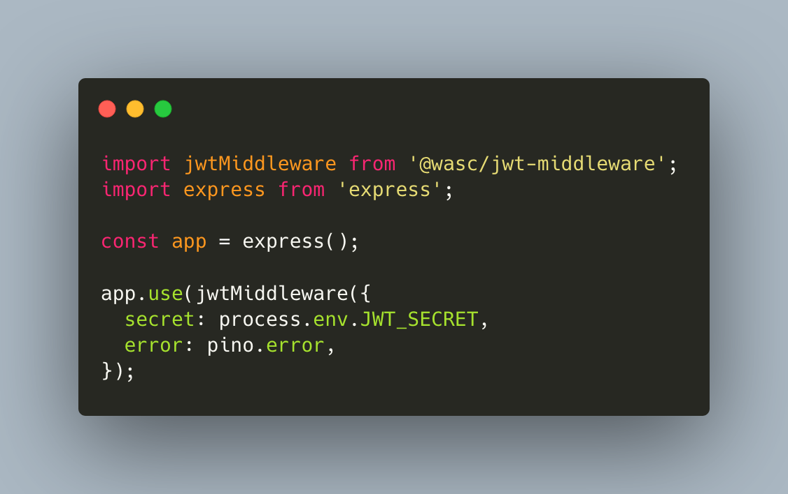

# extract-authentication-middleware

# [](https://git.nicolaischmid.de/wasc-npm/extract-authentication-middleware)

## Overview

[extract-authentication-middleware](https://git.nicolaischmid.de/wasc-npm/extract-authentication-middleware) is an express middleware for getting the authorization header of a request and its embeded JWT Token and decoding its content.

## Usage

Just like above:

```javascript
import checkAuthentication from '@private/extract-authentication-middleware'
import express from 'express';

const app = express();

app.use(checkAuthentication({
  secret: process.env.AUTHENTICATION_SECRET,
  error: pino.error,
});
```

Import the module, pass it the secret for verifying the token and use it. It works with CJS `require` as well.

## Configuration

- `secret` The secret for verifying the tokens signature
- `error` A error logging function for logging any non expected errors [default: pino.error]

## Data

If the authentication is successfull the middleware will create a few properties on the requets object:

```javascript
// request
{
    // ...
    scope: String, // The scope of the authication token
    user: {}, // The encoded user object
    auth: {
        isAuthenticated: true // false
        scope: String, // The scope like above
    }
    // ...
}
```

If the authentication fails, because the token is faulty, not signing properly or if there's any other error, the middleware terminates the request and returns either one of the following three responses:

1.  If the token was used past its expiration:

```javascript
// Status 401
{
    name: 'TokenExpired',
    message: 'The token cannot be used past its expiration',
}
```

2.  If the decoding of the token resulted in any errors, like untrusted signatures, malformed tokens or by providing an empty string as the token:

```javascript
// Status 401
{
    name: 'BadCredentials',
    message: 'The provided token could not be verified.',
}
```

3.  And if any other error occured, it will be logged using the provided logger or pino and the response is the following:

```javascript
// Status 400
{
    name: 'BadRequest',
    message: 'BadRequest',
}
```
